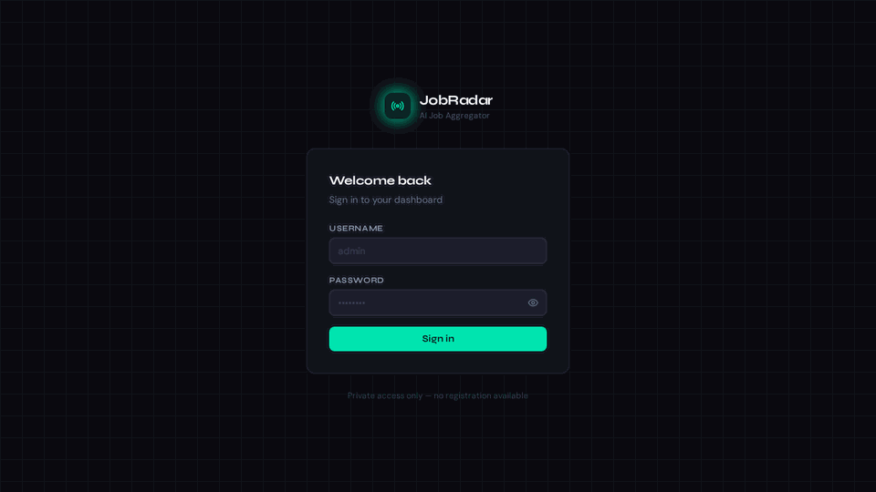
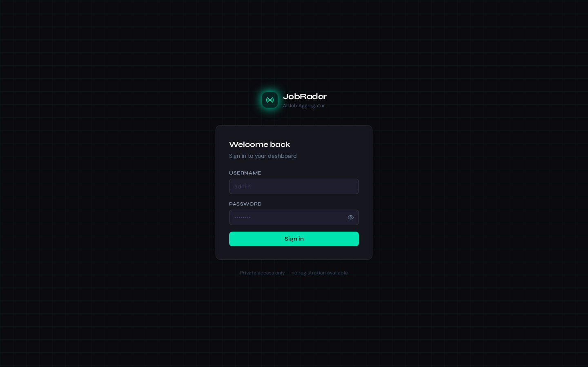
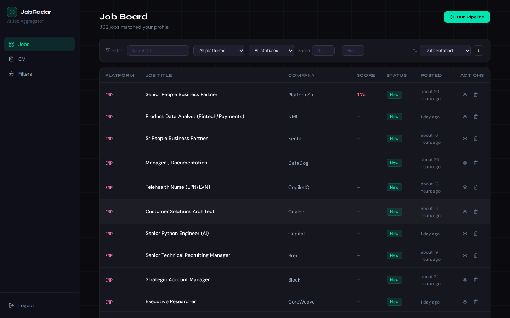
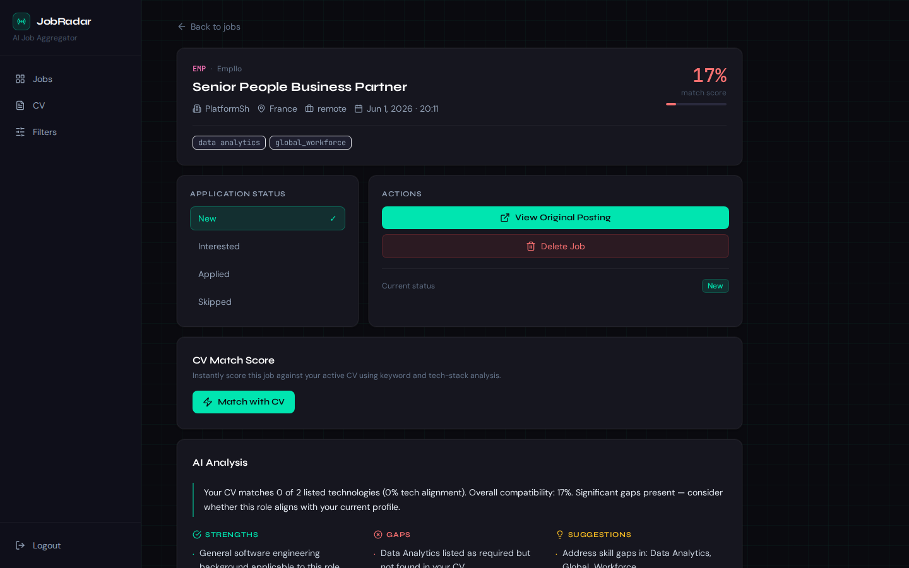
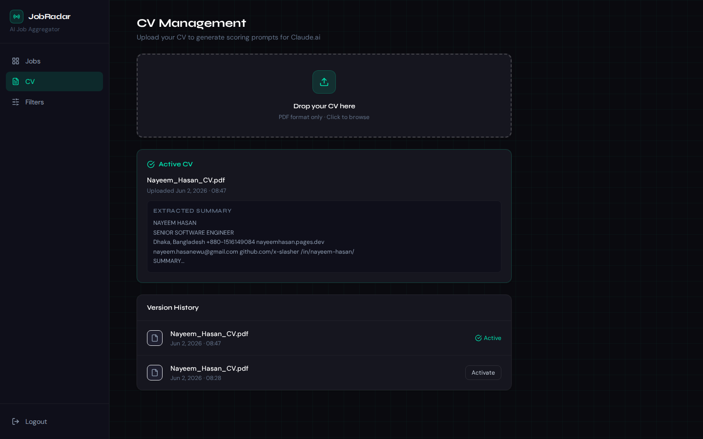
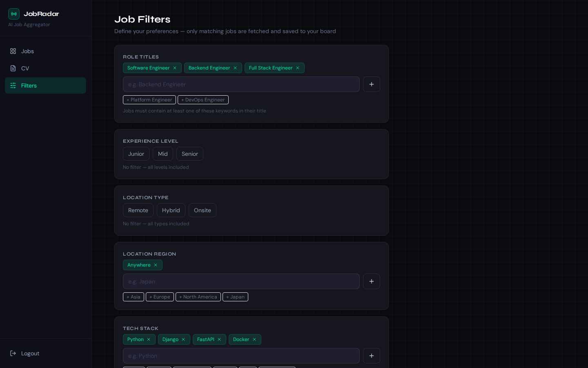

# JobRadar — Self-Hosted AI Job Aggregator

> A personal, self-hosted job board that automatically scrapes 8 remote job platforms daily, deduplicates listings, matches them against your CV, and presents everything in a clean dashboard so you can focus on applying — not searching.



---

## What It Does

JobRadar runs on your own server (or laptop) and does the heavy lifting of job hunting for you:

1. **Scrapes 8 platforms every day** — We Work Remotely, Himalayas, Arc.dev, RemoteOK, Working Nomads, Empllo, Remotive, and Arbeitnow
2. **Deduplicates** — SHA-256 fingerprint prevents the same job appearing twice, even across platforms
3. **Pre-filters by your preferences** — only jobs matching your role titles, experience level, location, and tech stack are saved
4. **Scores each job against your CV** — one click runs a keyword + tech-stack overlap analysis and produces a 0–100 match score with strengths, gaps, and suggestions
5. **Tracks your application pipeline** — mark jobs as New → Interested → Applied → Skipped
6. **Auto-cleans old listings** — jobs older than your configured retention window are removed daily

Everything is stored in a local SQLite file. No external database, no cloud dependency, no subscription.

---

## Screenshots

### Login


Single-user private access. JWT token stored in an `httpOnly` cookie. Login is rate-limited to 5 requests/minute per IP.

---

### Job Board (Dashboard)


The main view shows all fetched jobs in a paginated table. You can:
- **Search** by job title keyword
- **Filter** by platform, application status, and score range
- **Sort** by date fetched, date posted, score, title, or platform
- **Run Pipeline** manually to fetch new jobs immediately
- Click any row to open the job detail

---

### Job Detail


The detail page shows everything about a job:
- Full metadata: company, location, type, date posted, tech stack tags
- **Match score** (0–100%) displayed prominently in the header
- **Application Status** selector — click to move between New / Interested / Applied / Skipped
- **Match with CV** — one-click scoring against your active CV using keyword and tech-stack analysis
- **AI Analysis** — after matching, shows a summary, your strengths for this role, skill gaps, and suggestions
- **Job Description** — full HTML description rendered and sanitized
- **View Original Posting** — opens the source URL
- **Delete** — permanently removes the job

---

### CV Management


Upload your CV as a PDF. The app:
- Extracts text using `pdfplumber`
- Stores a 3,000-character summary used for all CV matching
- Keeps a version history — you can upload a new CV at any time and activate whichever version you want
- The active CV is used by all future match operations

---

### Job Filters


Define what gets saved to your board. Filters are applied during the pipeline — only jobs that pass all active filters are stored. Configure:
- **Role Titles** — keywords that must appear in the job title (e.g. "Backend Engineer", "Software Engineer")
- **Experience Level** — Junior / Mid / Senior (leave empty to include all)
- **Location Type** — Remote / Hybrid / Onsite (leave empty to include all)
- **Location Region** — Anywhere, Asia, Europe, North America, etc.
- **Tech Stack** — jobs must mention at least one of your listed technologies
- **Minimum Score Threshold** — hide jobs below a certain match score

---

## Tech Stack

### Backend
| Technology | Purpose |
|---|---|
| **Python 3.12** + **FastAPI** | REST API |
| **SQLAlchemy** + **SQLite** | ORM and local database |
| **Celery** + **Redis** | Background task queue |
| **Celery Beat** | Daily scheduler |
| **pdfplumber** | CV PDF text extraction |
| **httpx** + **BeautifulSoup** + **feedparser** | HTTP client and scrapers |
| **passlib[bcrypt]** + **python-jose** | Password hashing and JWT auth |
| **slowapi** | Login rate limiting |

### Frontend
| Technology | Purpose |
|---|---|
| **React 18** + **Vite** | UI framework and dev server |
| **TanStack Query** | Server state, caching, pagination |
| **React Router v6** | Routing |
| **Axios** | HTTP client with auto-401 redirect |
| **Tailwind CSS** | Utility-first styling |
| **DOMPurify** | HTML sanitization for job descriptions |
| **react-hot-toast** | Notifications |
| **lucide-react** | Icons |
| **date-fns** | Date formatting |

### Infrastructure
| Technology | Purpose |
|---|---|
| **Docker** + **Docker Compose** | Containerisation |
| **Caddy** | Reverse proxy with auto SSL (production) |
| **Nginx** | Frontend static file server (production) |
| **Redis** | Celery message broker |

---

## Architecture

```
[Celery Beat] ──triggers──▶ [Celery Worker]
                                    │
                       Fetch from 8 platforms
                                    │
                       Deduplicate (SHA-256)
                                    │
                       Pre-filter (user preferences)
                                    │
                       Save to SQLite (score = null)
                                    │
[React Dashboard] ◀──── [FastAPI REST API]
        │
        └─▶ Open job detail
                │
                └─▶ Click "Match with CV"
                        │
                    POST /api/jobs/{id}/match
                        │
                    Keyword + tech-stack scoring
                        │
                    Save score + analysis to SQLite
```

---

## Job Sources

| Platform | Method | Coverage |
|---|---|---|
| We Work Remotely | RSS feed | General remote jobs |
| Himalayas | JSON API | Remote-first roles |
| Arc.dev | Public scrape | Software engineering |
| RemoteOK | JSON API | Remote tech jobs |
| Working Nomads | REST API | Remote & nomad-friendly |
| Empllo | JSON API | Tech categories only (Engineering, Data, DevOps, Product) |
| Remotive | JSON API | Curated remote tech jobs |
| Arbeitnow | REST API | Remote roles (filtered by `remote: true`) |

---

## Project Structure

```
jobradar/
├── backend/
│   ├── app/
│   │   ├── api/routes/         # auth.py, jobs.py, cv.py, filters.py
│   │   ├── core/               # config.py, security.py, dependencies.py
│   │   ├── db/                 # database.py, init_db.py
│   │   ├── models/models.py    # Job, CVVersion, UserFilter, Platform
│   │   ├── schemas/schemas.py  # Pydantic schemas
│   │   ├── services/
│   │   │   ├── scrapers/       # One file per platform
│   │   │   ├── match_service.py   # CV-job keyword scorer
│   │   │   ├── cv_service.py      # PDF extraction
│   │   │   ├── deduplicator.py
│   │   │   └── filter_service.py
│   │   └── tasks/              # celery_app.py, job_tasks.py
│   ├── Dockerfile              # Production (non-root user)
│   ├── Dockerfile.dev          # Development (hot reload)
│   └── generate_hash.py        # Helper to generate bcrypt password hash
│
├── frontend/
│   ├── src/
│   │   ├── api/client.js       # All API calls via Axios
│   │   ├── components/         # Shared UI components
│   │   ├── pages/              # LoginPage, DashboardPage, JobDetailPage, CVPage, FiltersPage
│   │   └── utils/helpers.js    # Score colours, platform config, date formatting
│   ├── Dockerfile              # Production (Nginx static)
│   └── Dockerfile.dev          # Development (Vite hot reload)
│
├── infrastructure/
│   ├── caddy/Caddyfile         # Production SSL + reverse proxy
│   ├── nginx/nginx.conf        # Frontend Nginx config
│   └── scripts/setup-vps.sh   # One-time VPS hardening
│
├── docs/screenshots/           # README assets
├── docker-compose.dev.yml      # Dev: all services including frontend
├── docker-compose.prod.yml     # Prod: Caddy SSL, no exposed ports
├── .env.development            # Dev env template
└── .env.production             # Production env template
```

---

## Quick Start — Development

### Prerequisites
- Docker and Docker Compose

### 1. Clone and configure

```bash
git clone https://github.com/x-slasher/jobradar.git
cd jobradar
cp .env.development .env
```

### 2. Generate credentials

```bash
# Build the backend image first
docker compose -f docker-compose.dev.yml build fastapi

# Generate a random secret key
docker compose -f docker-compose.dev.yml run --rm fastapi \
  python -c "import secrets; print(secrets.token_hex(32))"

# Generate a bcrypt hash for your admin password
docker compose -f docker-compose.dev.yml run --rm fastapi \
  python generate_hash.py
```

> **Important:** The bcrypt hash must have a digit, `.`, or `/` immediately after the third `$` — Docker Compose treats a letter there as a variable name. If the first character after `$2b$12$` is a letter, run `generate_hash.py` again until you get a safe one.

Edit `.env` and fill in:
- `SECRET_KEY` — output from the first command
- `ADMIN_USERNAME` — your login username (e.g. `admin`)
- `ADMIN_PASSWORD_HASH` — bcrypt hash from the second command

### 3. Start everything

```bash
docker compose -f docker-compose.dev.yml up
```

This starts **6 services**: FastAPI (port 8001), Redis, Celery Worker, Celery Beat, and the Vite frontend dev server (port 5173).

Open **http://localhost:5173** and log in.

---

## Production Deployment (VPS)

### 1. Harden your VPS

```bash
# Run as root on a fresh Ubuntu 22.04 VPS
bash infrastructure/scripts/setup-vps.sh
```

Installs Docker, configures UFW firewall (ports 22/80/443 only), sets up fail2ban, and schedules daily SQLite backups.

### 2. Clone and configure

```bash
cd /opt
git clone https://github.com/x-slasher/jobradar.git jobradar
cd jobradar
cp .env.production .env
nano .env   # fill in all values
```

### 3. Set your domain

```bash
nano infrastructure/caddy/Caddyfile
# Replace yourdomain.com with your actual domain
```

### 4. Deploy

```bash
docker compose -f docker-compose.prod.yml up -d
```

Caddy automatically provisions a Let's Encrypt SSL certificate. The app is available at `https://yourdomain.com`.

---

## Environment Variables

All configuration lives in `.env`. Copy `.env.development` or `.env.production` as a starting template.

### Required

| Variable | Example | What it controls |
|---|---|---|
| `SECRET_KEY` | `a3f8d2...` | JWT signing key — use a random 64-char hex string |
| `ADMIN_USERNAME` | `admin` | Your login username |
| `ADMIN_PASSWORD_HASH` | `$2b$12$...` | bcrypt hash of your password — generate with `generate_hash.py` |

### App Behaviour

| Variable | Default | What it controls |
|---|---|---|
| `APP_ENV` | `production` | Set to `development` to enable API docs at `/api/docs` and verbose logging |
| `DEBUG` | `false` | Enables FastAPI debug mode — never use in production |
| `CORS_ORIGINS` | `http://localhost:5173` | Comma-separated list of allowed frontend origins — must match your domain in production |

### Scheduler

| Variable | Default | What it controls |
|---|---|---|
| `DAILY_JOB_HOUR` | `10` | Hour of day to run the fetch pipeline (24h format) |
| `DAILY_JOB_MINUTE` | `0` | Minute past the hour to run |
| `SCHEDULER_TIMEZONE` | `Asia/Dhaka` | Timezone for the scheduler — find your zone at [this list](https://en.wikipedia.org/wiki/List_of_tz_database_time_zones) |

### Data Retention

| Variable | Default | What it controls |
|---|---|---|
| `JOB_FETCH_WINDOW_HOURS` | `25` | How far back each scraper looks for new jobs. 25h overlaps yesterday's run so no listings are missed |
| `JOB_RETENTION_DAYS` | `4` | Jobs older than this are hard-deleted at the start of each pipeline run. Increase this if you want a longer history |

### Infrastructure

| Variable | Default | What it controls |
|---|---|---|
| `DATABASE_URL` | `sqlite:////app/data/jobs.db` | SQLite file path inside the container — change only if you move the data volume |
| `REDIS_URL` | `redis://redis:6379/0` | Redis connection string for Celery — matches the `redis` service name in Docker Compose |
| `CV_UPLOAD_DIR` | `/app/data/cv_files` | Where uploaded CV PDFs are stored inside the container |

---

## First Use

1. Log in at `/login`
2. Go to **Filters** — set your role titles (e.g. "Backend Engineer"), tech stack (e.g. "Python", "Docker"), and experience level. This controls what gets saved on every future pipeline run
3. Go to **CV** — upload your PDF CV. The app extracts and stores a text summary used for all matching
4. On the **Job Board**, click **Run Pipeline** to trigger an immediate fetch
5. Wait ~30 seconds for jobs to appear, then open any job and click **Match with CV** to get a score and analysis

The pipeline also runs automatically every day at `DAILY_JOB_HOUR:DAILY_JOB_MINUTE`.

---

## Security Notes

- Single-user only — no registration endpoint exists
- JWT token stored in an `httpOnly` cookie (inaccessible to JavaScript)
- Session expires after 30 minutes of inactivity
- Login endpoint rate-limited to 5 requests/minute per IP (fail2ban handles brute-force at the OS level in production)
- CV upload validates file extension, magic bytes (`%PDF`), and enforces a 10 MB limit
- Job description HTML is sanitised with DOMPurify before rendering
- In production all traffic goes through Caddy — no ports are exposed directly
- Docker containers run as non-root user
- All secrets live in `.env` — never commit this file
